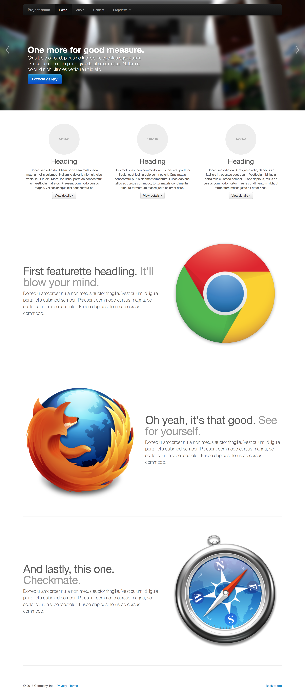

# 练习：使用Bootstrap制作简单页面

## 需求说明:

根据目标页面，在 `index.html` 中编写 HTML 代码。

目标页面：http://v2.bootcss.com/examples/carousel.html

## 挑战:

1. 运用Bootstrap栅格系统完成页面布局
2. 运用Bootstrap的[navbar](http://v3.bootcss.com/components/#navbar)组件实现导航栏
3. 运用Bootstrap的[thumbnail](http://v3.bootcss.com/components/#thumbnails-custom-content)和[img-circle](http://v3.bootcss.com/css/#images-shapes)组件实现内容板块
4. 运用Bootstrap的[carousel](http://v3.bootcss.com/javascript/#carousel)组件实现轮播展示

### 要求:

使用Bootstrap的[navbar](http://v3.bootcss.com/components/#navbar)组件实现一个类似的导航栏

使用Bootstrap的[thumbnail](http://v3.bootcss.com/components/#thumbnails-custom-content)和[img-circle](http://v3.bootcss.com/css/#images-shapes)组件实现一个类似的内容板块

使用Bootstrap的[carousel](http://v3.bootcss.com/javascript/#carousel)组件实现一个轮播展示

备注：样式不要求严格一样，功能实现即可。

## 学习资源

1. CSS W3school教程：[http://www.w3school.com.cn/css/index.asp](http://www.w3school.com.cn/css/index.asp)

2. Bootstrap中文文档：[http://www.bootcss.com/](http://www.bootcss.com/)

3. CSS盒子模型（[http://www.w3school.com.cn/css/css_boxmodel.asp](http://www.w3school.com.cn/css/css_boxmodel.asp)）

4. 栅格系统（[http://v3.bootcss.com/css/#grid](http://v3.bootcss.com/css/#grid)）

5. 什么是响应式设计（[https://www.zhihu.com/question/20976405](https://www.zhihu.com/question/20976405)）

6. Bootstrap UI组件使用方法（[http://v3.bootcss.com/components/](http://v3.bootcss.com/components/)）
